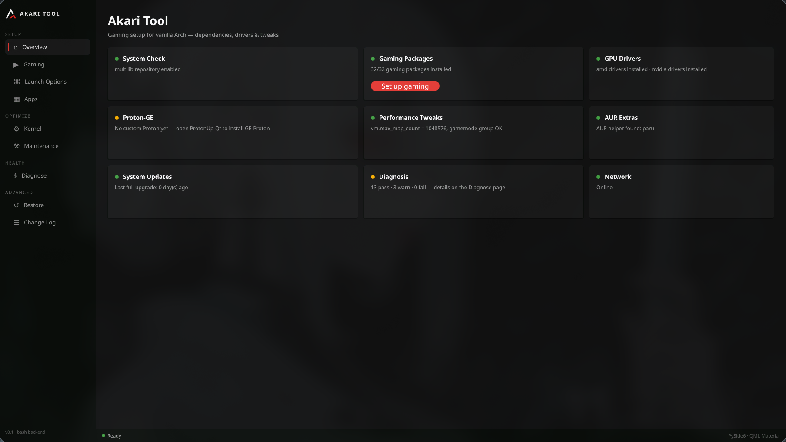

<p align="center"></p>
<h1 align="center">Akari Tool Linux</h1>
<p align="center">Gaming setup for vanilla Arch — dependencies, drivers, kernels & diagnosis.<br>
The Linux counterpart to Akari Tool for Windows.</p>

<p align="center"></p>

## Why

Setting up gaming on a fresh Arch install means multilib, thirty-odd packages,
GPU drivers, lib32 drivers, tweaks, and a handful of traps (UKI boot chains,
dkms, NTFS Steam libraries). Existing script collections are fragile.
Akari Tool does it reliably: **show the plan before, stream the log during,
record every change after.**

## Features

- **One-click gaming setup** — Steam, Lutris, Wine, MangoHud, gamescope, umu,
  fonts, PipeWire audio (incl. the lib32 pieces Proton needs), controller
  udev rules, and the full lib32 dependency set (baseline derived from
  CachyOS's gaming meta-packages, translated to vanilla Arch)
- **Everything in-app** — AUR packages (Heroic, ProtonUp-Qt, GOverlay) install
  directly from the GUI, no external terminal. No AUR helper yet? Akari
  bootstraps paru for you — or skip the AUR entirely with the Flatpak track
- **Apps page** — a system-wide uninstaller. Search everything you installed,
  see sizes and descriptions, remove with a dependency preview. Critical
  system packages are protected and can never be removed from the GUI
- **GPU driver detection** — AMD / Intel / NVIDIA, with variant-aware NVIDIA
  handling (open vs dkms, headers per kernel)
- **Kernel manager** — install/remove zen, LTS, or CachyOS kernels safely:
  never touches the running kernel, understands UKI boot chains (preset
  conversion, sbctl signing, dynamic GRUB menus)
- **Maintenance** — bootstrap paru, rank the fastest pacman mirrors
  (reflector), trim the package cache & remove orphans, set up Flatpak +
  Flathub, and take manual snapshots — each a one-click card with live status
- **Snapshots before every change** — with snapper (btrfs) or timeshift
  installed, Akari takes a real pre-change snapshot before installs, kernel
  changes, upgrades, and removals (and steps aside if snap-pac already
  handles it)
- **Diagnose** — functional tests, not package lists: does Vulkan respond in
  64 *and* 32 bit, is the discrete GPU visible, are dkms modules built for
  every kernel, is audio alive (incl. lib32), controllers detected and
  permissioned, Steam-on-NTFS, Hyprland gaming settings
- **Launch options builder** — compose `gamemoderun mangohud gamescope ... %command%`
  from toggles
- **Trust layer** — every action shows its plan first, streams live output,
  logs every change, keeps backups, and offers one-click restore.

## Install

From source (Arch):

```bash
sudo pacman -S pyside6
git clone https://github.com/isleap/Akari-Tool-Arch
cd Akari-Tool-Arch
python main.py
```

The backend works standalone with no GUI:

```bash
./backend/akari-setup.sh --help
./backend/akari-setup.sh check
./backend/akari-setup.sh plan gaming     # dry-run
./backend/akari-setup.sh plan cleanup    # what would cleanup remove?
./backend/akari-setup.sh apply mirrors   # rank the fastest mirrors
./backend/akari-setup.sh plan remove lutris   # preview an uninstall
```

## Architecture

```
backend/akari-setup.sh   bash    — ALL system logic (check / plan / apply)
akari/                   python  — thin Qt host (QProcess bridge, no logic)
ui/                      QML     — Material dark UI (components + pages)
packaging/               —       — PKGBUILD, .desktop, icon
docs/                    —       — screenshots
```

Rules: system logic only in bash; colors only in `ui/components/Theme.qml`;
new page = file in `ui/pages/` + NavItem + StackLayout entry.

## Status

v0.2.0 — tested on one gloriously complicated machine (Hyprland, Secure Boot,
UKI + GRUB, snapper, hybrid AMD iGPU + RTX 5070, nvidia-open-dkms) and a
fresh-install VM.
Bug reports welcome — that's how v0.3 gets built.
