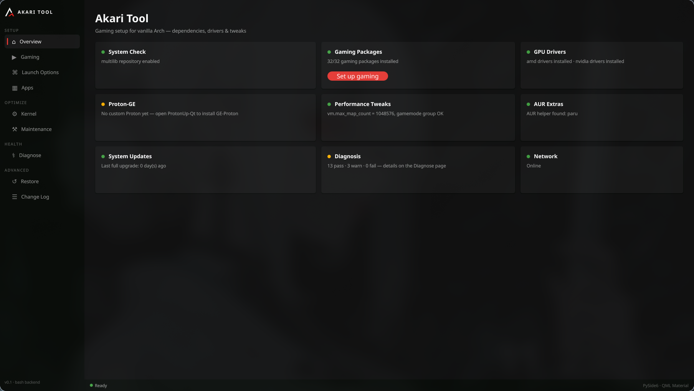

<p align="center"></p>
<h1 align="center">Akari Tool Linux</h1>
<p align="center">Gaming setup for vanilla Arch — dependencies, drivers, kernels & diagnosis.<br>
The Linux counterpart to Akari Tool for Windows.</p>

<p align="center"></p>

## Why

Setting up gaming on a fresh Arch install means multilib, thirty-odd packages,
GPU drivers, lib32 drivers, tweaks, and a handful of traps (UKI boot chains,
dkms, NTFS Steam libraries). Existing script collections are fragile.
Akari Tool does it reliably: **show the plan before, stream the log during,
record every change after.**

## Features

- **One-click gaming setup** — Steam, Lutris, Wine, MangoHud, gamescope, umu,
  fonts, PipeWire audio (incl. the lib32 pieces Proton needs), controller
  udev rules, and the full lib32 dependency set (baseline derived from
  CachyOS's gaming meta-packages, translated to vanilla Arch)
- **Everything in-app** — AUR packages (Heroic, ProtonUp-Qt, GOverlay) install
  directly from the GUI, no external terminal. No AUR helper yet? Akari
  bootstraps paru for you — or skip the AUR entirely with the Flatpak track
- **Apps page** — a system-wide uninstaller. Search everything you installed,
  see sizes and descriptions, remove with a dependency preview. Critical
  system packages are protected and can never be removed from the GUI
- **GPU driver detection** — AMD / Intel / NVIDIA, with variant-aware NVIDIA
  handling (open vs dkms, headers per kernel)
- **Kernel manager** — install/remove zen, LTS, or CachyOS kernels safely:
  never touches the running kernel, understands UKI boot chains (preset
  conversion, sbctl signing, dynamic GRUB menus)
- **Maintenance** — bootstrap paru, rank the fastest pacman mirrors
  (reflector), trim the package cache & remove orphans, set up Flatpak +
  Flathub, and take manual snapshots — each a one-click card with live status
- **Safe system updates** — the upgrade plan shows the pending package list,
  flags kernel updates, and pulls the latest Arch news headlines (the
  manual-intervention notices) before you confirm; afterwards Akari reports
  new `.pacnew` files and warns when a reboot is needed
- **Snapshots before every change** — with snapper (btrfs) or timeshift
  installed, Akari takes a real pre-change snapshot before installs, kernel
  changes, upgrades, and removals (and steps aside if snap-pac already
  handles it)
- **Diagnose** — functional tests, not package lists: does Vulkan respond in
  64 *and* 32 bit, is the discrete GPU visible, are dkms modules built for
  every kernel, is audio alive (incl. lib32), controllers detected and
  permissioned, Steam-on-NTFS, Hyprland gaming settings
- **Games page** — your library from Steam, Lutris and Heroic in one searchable
  list, showing which compatibility tool each game runs on. Expand a game to
  pick which Proton/Wine build it runs on, and build its launch options from
  toggles, written straight into the right launcher's config (safe edit with backup; refuses while that launcher is
  running, since all three overwrite their config on exit). Unrecognised flags
  you set by hand are preserved, not silently dropped
- **Proton page** — install GE-Proton and Wine-GE builds from GitHub into the
  directory each launcher scans, verified against the published sha512sum and
  unpacked as your user (Steam ignores root-owned compatibility tools), then
  **actually switch to them**: installing a build only makes it available, so
  the page shows which build each launcher is using right now and offers
  *Install & use* in one step. Warns when a launcher is pointed at a build
  that has since been deleted, which otherwise silently falls back to stock.
  Steam and Heroic get Proton builds, Lutris and Heroic get Wine builds.
  One-click prune keeps the newest few — each build is ~1.5 GB
- **Launch options builder** — compose `gamemoderun mangohud gamescope ... %command%`
  from toggles when you just want the string to paste somewhere yourself
- **Trust layer** — every action shows its plan first, streams live output,
  logs every change, keeps backups, and offers one-click restore.

## Install

From source (Arch):

```bash
sudo pacman -S pyside6
git clone https://github.com/isleap9/Akari-Tool-Arch
cd Akari-Tool-Arch
python main.py
```

The backend works standalone with no GUI:

```bash
./backend/akari-setup.sh --help
./backend/akari-setup.sh check
./backend/akari-setup.sh plan gaming     # dry-run
./backend/akari-setup.sh plan cleanup    # what would cleanup remove?
./backend/akari-setup.sh apply mirrors   # rank the fastest mirrors
./backend/akari-setup.sh plan remove lutris   # preview an uninstall
./backend/akari-setup.sh games                # every installed game, all launchers
./backend/akari-setup.sh proton               # Proton/Wine builds, installed + available
./backend/akari-setup.sh apply proton-install proton-ge GE-Proton10-6 steam default
./backend/akari-setup.sh apply compat-default steam GE-Proton10-6   # switch to it
./backend/akari-setup.sh apply gamerunner steam 1091500 GE-Proton10-6   # one game
./backend/akari-setup.sh apply gameopts steam 1091500 "gamemoderun mangohud %command%"
```

The Proton and Games commands need no root at all — they only ever touch files
your user already owns.

## Architecture

```
backend/akari-setup.sh   bash    — entry point: shell options, module loader, dispatch
backend/lib/*.sh         bash    — ALL system logic, one module per concern
                                    (core, checks, kernels, plans, diagnose,
                                     steam, proton, games, maintenance, ...),
                                     sourced in order
akari/                   python  — thin Qt host (QProcess bridge, no logic)
ui/                      QML     — Material dark UI (components + pages)
packaging/               —       — PKGBUILD, .desktop, icon
docs/                    —       — screenshots
```

Rules: system logic only in bash (new logic goes in the matching lib/ module,
or a new NN-name.sh — the NN prefix sets source order); colors only in `ui/components/Theme.qml`;
new page = file in `ui/pages/` + NavItem + StackLayout entry.

## Status

v0.2.0 — tested on one gloriously complicated machine (Hyprland, Secure Boot,
UKI + GRUB, snapper, AMD Ryzen 7 5800x, RTX 5070, (nvidia-open-dkms) and a
fresh-install VM.
Bug reports welcome — that's how v0.3 gets built.
